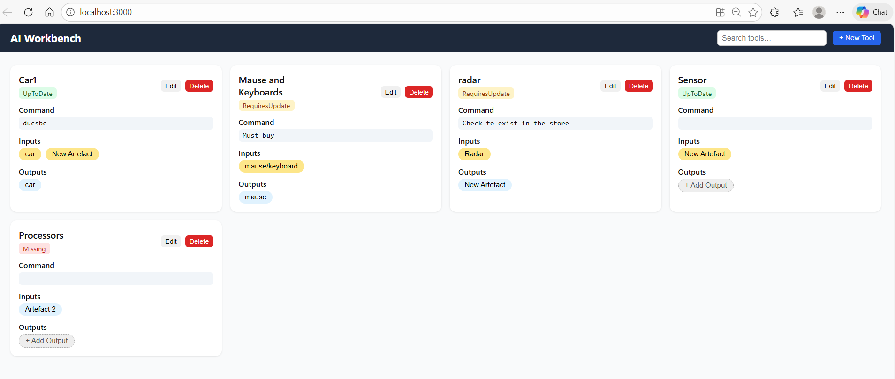

# Frontend – AI Workbench

## Description

This folder contains the frontend of the AI Workbench.
It is a React-based web application that provides the user interface

## 🛠 Technologies Used

- React
- JavaScript
- Node.js
- REST API
- Git & GitHub

## 🚀 Key Features

- Modular frontend architecture
- Clear separation of frontend and backend
- Scalable REST-based design
- User-friendly UI

## ▶️ How to Run the Project

npm install
npm start

The application runs at:
http://localhost:3000

📷 Screenshots

### Dashboard

🔗 Author

Maryam Kohansal
Bachelor Thesis Project
